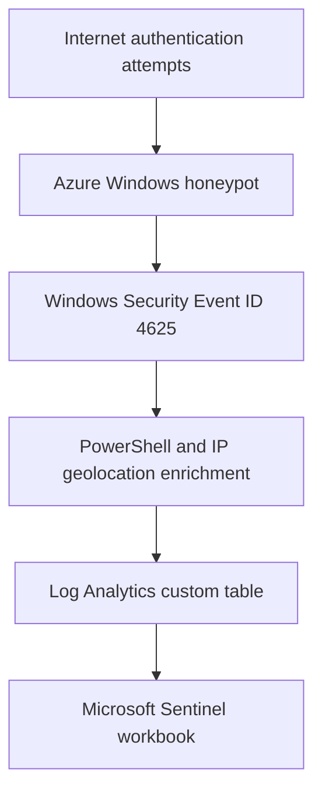

# Azure Honeypot and Microsoft Sentinel SIEM Lab

A cloud-security monitoring lab that used an intentionally exposed Windows virtual machine to collect failed Remote Desktop authentication events, enrich source IP addresses with geolocation data, and visualize the activity in Microsoft Sentinel.

> **Lab scope:** This was an authorized, disposable training environment. The exposure settings shown here are not appropriate for production systems.

## Project outcome

This project demonstrates an end-to-end cloud SIEM workflow:

1. Deployed a Windows virtual machine in Microsoft Azure.
2. Observed failed RDP authentication activity through Windows Security Event ID 4625.
3. Used PowerShell to extract event data.
4. Enriched source IP addresses with an IP geolocation API.
5. Ingested the enriched records into an Azure Log Analytics workspace.
6. Used Kusto Query Language (KQL) to structure and analyze the data.
7. Built a Microsoft Sentinel workbook that mapped authentication activity geographically.

## Architecture

## Repository contents

| Path | Description |
| --- | --- |
| [`scripts/Export-FailedRdpEvents.ps1`](scripts/Export-FailedRdpEvents.ps1) | Exports Event ID 4625 telemetry from the Windows Security log without embedding credentials |
| [`queries/failed-rdp-analysis.kql`](queries/failed-rdp-analysis.kql) | Reusable Microsoft Sentinel searches for failed-logon volume, targeted accounts, and failure-to-success correlation |
| [`docs/lab-security-and-cleanup.md`](docs/lab-security-and-cleanup.md) | Safety controls, validation steps, and an Azure teardown checklist |
| [`.gitignore`](.gitignore) | Prevents local secrets, exports, and generated logs from entering source control |

## Technologies used

| Technology | Purpose |
| --- | --- |
| Microsoft Azure Virtual Machines | Hosted the disposable Windows endpoint |
| Azure network security rules | Controlled inbound exposure to the lab VM |
| Windows Security Event Log | Recorded failed authentication attempts |
| PowerShell | Extracted and enriched event data |
| IP geolocation API | Added approximate geographic context to source IPs |
| Azure Log Analytics | Stored the enriched custom log records |
| Kusto Query Language (KQL) | Parsed, queried, and summarized the data |
| Microsoft Sentinel | Provided SIEM analysis and workbook visualization |

## Relevant telemetry

The primary event used in this project was **Windows Security Event ID 4625: An account failed to log on**. Useful fields include the target account, logon type, source network address, workstation name, failure reason, status, and substatus.

For this lab, source IP addresses were enriched with geographic information before being ingested into Log Analytics. Geolocation provides useful aggregation context, but it does not establish the identity or physical location of an attacker.

## Implementation

### 1. Azure environment

A Windows virtual machine was deployed in Azure as the monitored honeypot endpoint.

### 2. Network exposure

The original lab used a highly permissive inbound rule so the VM would receive unsolicited traffic.

This configuration intentionally created significant risk and should not be copied into a production environment. A safer recreation should expose only the service being studied, restrict outbound connectivity, use a short observation period, and remove the resources immediately after testing.

### 3. Remote Desktop connectivity

Remote Desktop Protocol was used to administer the Windows lab host.

### 4. Host firewall configuration

Windows Defender Firewall was disabled during the original experiment to increase visibility to unsolicited traffic.

Disabling host protections is dangerous and unnecessary for most modern honeypot designs. This screenshot is retained as historical evidence of the lab configuration, not as a recommended security practice.

### 5. Event extraction and enrichment

PowerShell was used to collect Event ID 4625 records and enrich source IP addresses through an IP geolocation service.

API credentials should never be committed to source control or exposed in screenshots. Any key used for a temporary lab should be revoked after the project is complete.

### 6. Log Analytics and KQL

The enriched records were stored in a custom Log Analytics table. KQL was then used to transform the records into fields suitable for analysis and visualization.

### 7. Microsoft Sentinel workbook

A Microsoft Sentinel workbook displayed the source-location data on a map, making repeated authentication activity easier to compare geographically.

### 8. Updated observation window

The following view shows how the workbook changed after additional events accumulated within the configured 24-hour display window.

## Analysis

- An internet-facing Windows host began receiving failed authentication attempts without requiring direct solicitation.
- Event ID 4625 provided useful account, failure, logon-type, and source-network context.
- Geographic enrichment made large collections of source addresses easier to summarize visually.
- A failed authentication event shows an attempted logon; it does not prove that the system was compromised.
- Source-IP geolocation is approximate and should not be treated as reliable attribution. VPNs, proxies, cloud infrastructure, botnets, and compromised hosts can obscure an operator's true location.
- Determining whether access succeeded would require correlation with successful logon events such as Event ID 4624 and additional endpoint or network telemetry.

## Security and ethical considerations

Honeypots are intentionally exposed systems and therefore create real operational risk. Isolation reduces that risk but does not eliminate it. A compromised honeypot can be abused to scan or attack other systems if outbound traffic is not controlled.

Anyone recreating this project should:

- Use only accounts and cloud resources they own or are explicitly authorized to test.
- Keep production data, credentials, and services out of the environment.
- Expose only the minimum service required for the experiment.
- Apply outbound network restrictions and cost controls.
- Monitor the environment continuously.
- Store API secrets outside scripts and repositories.
- Use a short, defined collection window.
- Restore host protections and decommission all cloud resources after testing.

## Skills demonstrated

- Microsoft Azure virtual-machine deployment
- Cloud network-security configuration
- Windows authentication-log analysis
- PowerShell event processing
- REST API data enrichment
- Azure Log Analytics ingestion
- Kusto Query Language
- Microsoft Sentinel workbook development
- SIEM investigation and visualization
- Security documentation and risk communication

## Limitations

- The screenshots document the original experiment; the included script and queries are sanitized, reusable examples and may require field mapping for a different Log Analytics schema.
- IP geolocation is contextual enrichment, not attacker attribution.
- The project focused on failed RDP authentication and did not establish whether any logon succeeded.
- The workbook displayed a limited observation window rather than a long-term behavioral baseline.
- No automated analytic rule, incident workflow, or response playbook was implemented.

## Future improvements

- Restrict inbound exposure to the single service being studied.
- Add explicit outbound controls and document resource teardown.
- Correlate Event ID 4625 failures with Event ID 4624 successes.
- Build a Microsoft Sentinel analytic rule for repeated failures.
- Add secret-safe geolocation enrichment that reads the API key from an environment variable or managed secret store.
- Record the collection duration, event count, unique source IPs, and countries observed.
- Add a short investigation report describing the most significant patterns and final assessment.

## Conclusion

This project demonstrated how Windows authentication telemetry can be collected, enriched, queried, and visualized in a cloud SIEM. It also highlighted an important operational lesson: intentionally exposed resources can produce useful security data, but they must be treated as genuinely risky systems and managed with strict scope, monitoring, and teardown procedures.
